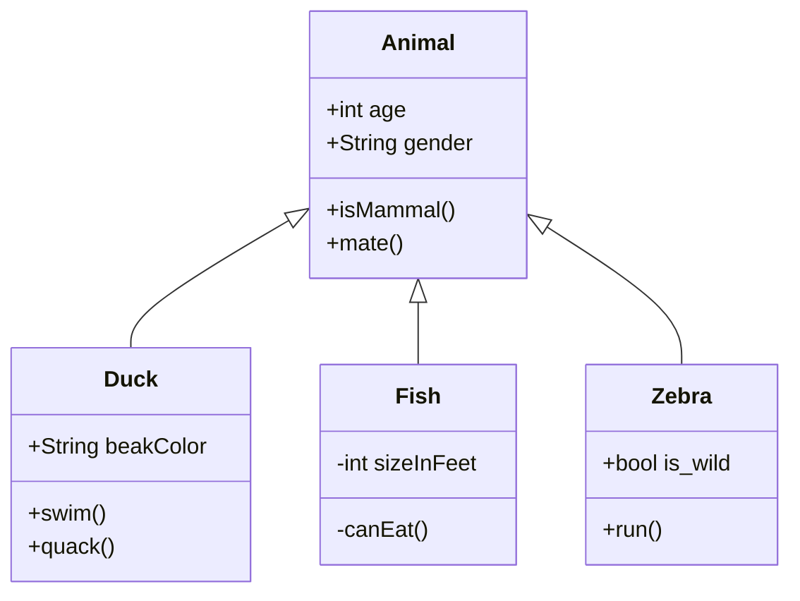

# Twister
## _The best Telegram bot for get weather_

This project was created for demonstrate and improvement my abilities in the differents areas like:
- Python
- Security
- Object-oriented programming (OOP)
- Documentation
- Development the news projects
- Git:
    * Basic commands
    * Branches
    * Relases
- Application management
- Data Base
- Data Analytic
- Code Style

I'm not trying to create something revolutionary or useful.

## About me
My name is [Agustin Urquiza](agustin.h.urquiza@gmail.com), I have a Bachelor in computer science obtained in FaMAF UNC. I have four years of experience in software development.


## Use cases and front end
I implemented a simple [telegram bot](https://t.me/terminator_2000_bot) that can get the weather in different places around the world. It can respond to two possible commands: **Telegram location** and **/place [city]**. The bot responds to your message with a .png image (124 KB). If you share your real location, it only responds once. Here are some examples:


Also the bot support two commands more:

- **help:**
    > ************************* The twister Bot *************************\
    > Usage:\
    > \* /help: Get help mensagge.\
    > \* /start: Get information about this Bot.\
    > \* /place city: Get current weather in that city.\
    > \* Location: Get current weather in your location.

- **start:**
    > ************************* The twister Bot *************************\
    > It uses to obtain the weather in the different cities of the world.\
    > This bot may be tracked your data, username, location, lenguaje, etc.\
    > Author: Agustin Urquiza\
    > agustin.h.urquiza@gmail.com

## Statitics

After you presed ctrl-c the python program calculate and show two plots, numbers of requests and clients, and a map with the requests locations.

```{r showChoro1}
<<insertHTML:[./stat/2023-03-13_map.html]
```


## Architecture


